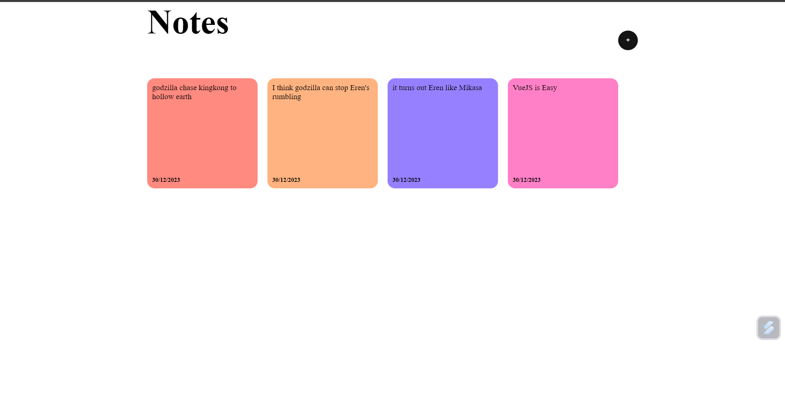

# Result

# Things Learned
1. **ref : State Storage**
`const showModal = ref(false)`

`const newNote = ref("")`

1. **Directives** are instructions for Vue to do certain things
example: `v-if=showModal` = it will render the component if `showModal = true`
- `v-if` vs `v-show` : v-show = display: none,   v-if = dont show the component at all

2. **v-model derectives for Two Way Binding** 
if we update through state it will chanche in `textarea` and vice viersa

3. **v-for directives**
for looping component fragment,
-- it needs `:key="<unique value>"` for update tracing to avoid unnecessary re-render

4. **':' is a shorthand for v-bind**
This is binding the style attribute of an HTML element to a JavaScript object.

# Unseen Feature
validator, if text is less than 10 character then note cant be added
